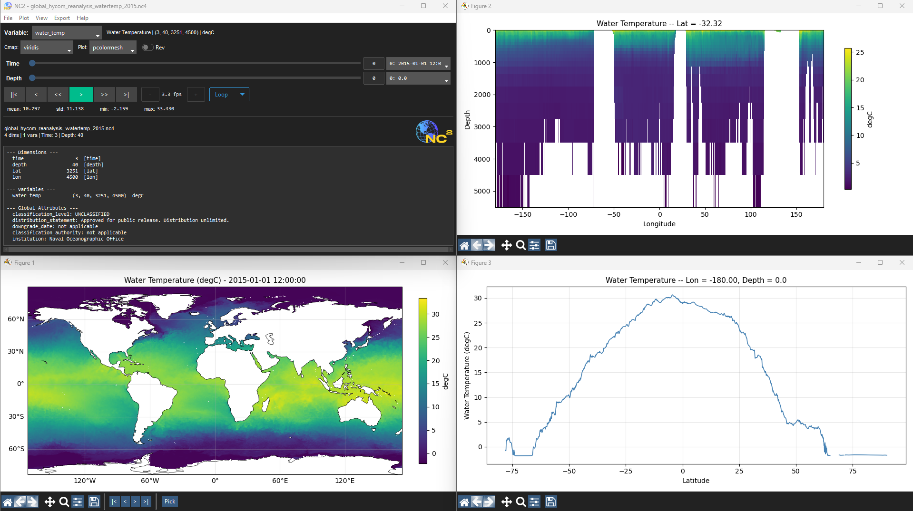

<p align="center">
  
</p>

<p align="center">
  <a href="https://pypi.org/project/nc2/"></a>
  <a href="https://www.gnu.org/licenses/gpl-3.0"></a>
</p>

<p align="center">
Lightweight NetCDF viewer with detached plot windows, GIF export, and full matplotlib customization.
</p>

<p align="center">
  
</p>

## Install

```
pip install nc2
```

Requires Python 3.8+. Cartopy is needed for map projections (optional for non-geographic data).

## Usage

```
nc2                          # launch empty, open file from menu
nc2 data.nc                  # open a file directly
python -m nc2 data.nc4       # alternate invocation
```

## Features

- **Spatial plots** -- pcolormesh, contourf, contour, imshow, quiver, streamplot
- **Vertical sections** -- depth vs. lat/lon cross-sections
- **Timeseries** -- click any point to extract temporal evolution
- **Depth profiles** -- vertical structure at a point
- **GIF export** -- animate over time with configurable FPS and frame range
- **Full matplotlib API** -- normalization (log, symlog, power), interpolation, alpha, colorbar controls, contour styling, quiver/streamplot parameters
- **182 colormaps** -- every registered matplotlib colormap at runtime
- **Cartopy projections** -- PlateCarree, Mercator, Robinson, Orthographic, and more
- **Flexible dimensions** -- auto-detects time/depth/lat/lon, manual override for non-standard files
- **Extra dimensions** -- unassigned dims get their own sliders automatically
- **Playback** -- animate through time with loop/bounce/once modes and speed control
- **Detached windows** -- each plot is an independent matplotlib window with toolbar
- **Batch export** -- export all frames as individual images
- **Performance** -- LRU slice cache, lazy coordinate loading, threaded I/O

## Dependencies

| Package | Purpose |
|---------|---------|
| numpy | Array operations |
| matplotlib | Plotting engine |
| netCDF4 | File I/O |
| cartopy | Map projections and features |
| ttkbootstrap | GUI styling |
| Pillow | Image handling |
| imageio | GIF assembly |

## License

GPL-3.0. Copyright (c) 2024 Rhett R. Adam.
